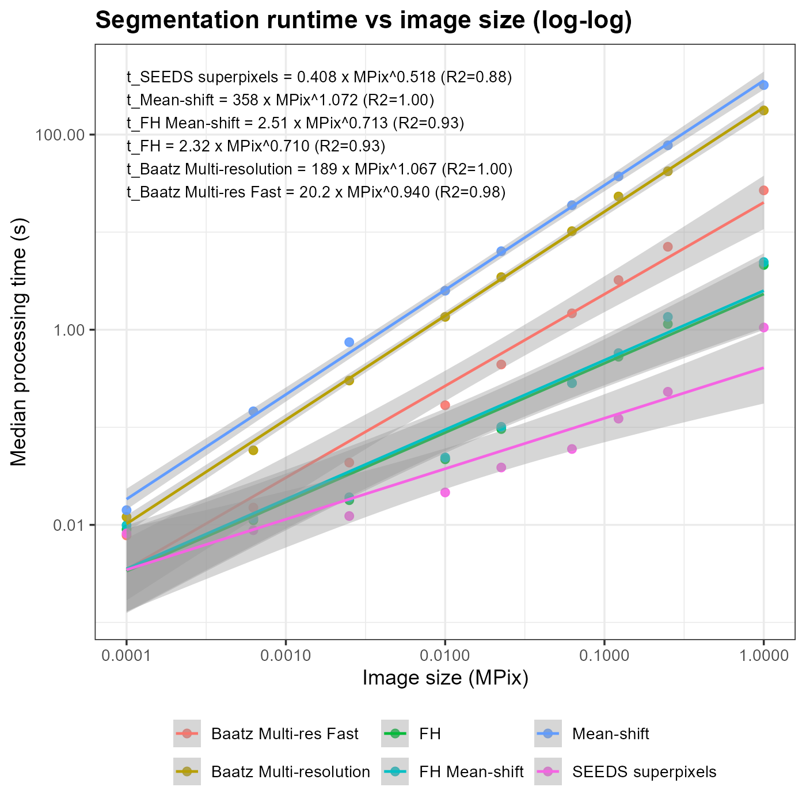

> ⚠️**Warning: development version**
>
> This R package is currently in active development.\
> Features may be incomplete, change without notice, or behave unexpectedly.\
> Use with caution, and do not rely on it for production workflows.

# Geospatial image segmentation in R

The **rsegm** package provides scalable, high-performance tools for **geospatial image segmentation** built on top of **terra**, **Rcpp**, and modern block-wise / tiled processing strategies. It is designed for object-based image analysis (OBIA) workflows on large raster datasets, including satellite and aerial imagery.

The core focus is on producing **spatially coherent, integer-labeled segment rasters** that integrate cleanly with downstream raster and vector analysis in R.


## Main features

-   **Graph-based and hybrid segmentation algorithms**
    -   Fast Felzenszwalb-Huttenlocher (FH) graph-based segmentation
    -   Hybrid FH + region-level Mean Shift segmentation for higher-quality objects
    -   Mean-shift
    -   Baatz-Schäpe multi-resolution
    -   Fast Baatz-Schäpe multi-resolution
    -   SEEDS
-   **Large-raster support**
    -   Robust tiled processing for rasters that do not fit comfortably in memory
    -   Seam-aware merging to avoid boundary artifacts
-   **Efficient C++ backends**
    -   Computationally intensive steps implemented in Rcpp for speed and scalability
-   **terra-native design**
    -   Uses `SpatRaster` throughout
    -   Produces standard GeoTIFF outputs with integer segment IDs

## Segmentation methods

The package currently includes:

-   **FH graph-based segmentation**\
    A fast, noise-robust method often used to generate superpixels or initial regions, suitable for large multi-band rasters.

-   **FH + mean shift hybrid segmentation**\
    A two-stage approach combining FH over-segmentation with region-level Mean Shift refinement to merge spectrally similar regions efficiently, producing object-like segments well suited for OBIA workflows.

-   **Mean Shift segmentation**\
    A pixel-domain mean-shift filtering and clustering method that produces smooth, spectrally homogeneous segments but with higher computational cost, best suited for small to medium-sized images.

-   **Baatz–Schäpe multiresolution segmentation**\
    A classical OBIA algorithm that iteratively merges adjacent regions based on spectral heterogeneity and shape criteria, producing high-quality multi-scale objects at the expense of higher runtime.

-   **Fast Baatz–Schäpe multiresolution segmentation**\
    An optimized variant of the Baatz–Schäpe algorithm using efficient region bookkeeping and priority-queue merging to achieve substantially faster performance on small to medium rasters.

-   **SEEDS superpixel segmentation**\
    A hierarchical, histogram-based superpixel method that starts from a regular grid and refines boundaries via local block moves, designed for speed, locality, and tile-friendly large-raster processing.

All methods return a single-layer raster where each cell contains an integer segment identifier.

**Example**

``` r
library(terra)
library(rsegm)

r <- rast(sample_raster_path()) 

print(r)

# Segment image using FH method
#
seg <- fh_segmenter(
  r,
  k = 0.5,
  min_size = 40,
  eight = TRUE,
  scale_bands = TRUE,
  smooth = 3
)

seg_pol   <- as.polygons(seg, dissolve = TRUE)
seg_lines <- as.lines(seg_pol)

rgb <- r[[1:3]]
rgb <- stretch(rgb)

plotRGB(rgb, r=1, g=2, b=3, stretch="lin")
plot(seg_lines, add=TRUE, col="yellow", lwd=0.8)
```

## Tiled processing

For large scenes, segmentation can be executed in a **tiled workflow** that:

1.  Splits the input raster into buffered tiles on disk\
2.  Segments each tile independently\
3.  Ensures globally unique segment IDs across tiles\
4.  Detects and merges adjacent segments across tile seams\
5.  Produces a single, seamless output raster

This approach allows segmentation of very large rasters while maintaining correctness and reproducibility.

## Typical workflow with tiling

``` r

library(terra)
library(rsegm)

r <- rast("very_large_multispectral_image.tif")

seg <- fh_segmenter_tile(
  r,
  tile_size = 2048,
  buffer = 64,
  k = 0.7,
  min_size = 60,
  smooth = 3,
  out_file = "segmented.tif"
)
```

## Tiling and segmentation parameters

This section explains the main parameters controlling tiled segmentation and provides practical guidance for selecting appropriate values.

### `tile_size`

Defines the **spatial size (in pixels)** of each processing tile.\
Each tile is segmented independently and later merged.

-   Larger values reduce the number of seams but require more memory
-   Smaller values lower memory usage but increase the number of tile boundaries

This parameter controls the **fundamental processing unit** of the tiled workflow.

------------------------------------------------------------------------

### `buffer`

Defines the **overlap (in pixels)** added around each tile.

-   Prevents artificial boundaries at tile edges
-   Ensures sufficient spatial context for segments near tile borders
-   Used during both segmentation and seam reconciliation

The buffer should generally be **larger than the expected object size** and larger than the segmentation neighborhood.

------------------------------------------------------------------------

### `k`

Segmentation **scale parameter** for graph-based segmentation.

-   Lower values produce many small segments (over-segmentation)
-   Higher values produce fewer, larger segments

While `k` is independent of tiling, it strongly influences how visible tile seams become if set too low.

### Recommended settings

| Scenario | tile_size | buffer | k | Notes |
|---------------|---------------|---------------|---------------|---------------|
| Small raster (\< 5k x 5k) | 2048-4096 | 64 | 0.4-0.7 | Larger tiles reduce seam handling |
| Large raster, limited RAM | 1024-2048 | 64-96 | 0.6-1.0 | Balance memory use and seam robustness |
| High-resolution imagery (\<=0.5 m) | 2048 | 96-128 | 0.3-0.6 | Larger buffer needed for fine detail |
| Coarse-resolution imagery (\>= 10 m) | 4096 | 32-64 | 0.8-1.5 | Fewer seams, larger objects |
| Urban / textured scenes | 2048 | \>= 96 | 0.4-0.7 | Buffer critical to avoid edge artifacts |
| Homogeneous landscapes | 4096 | 32-64 | 0.8-1.2 | Large tiles preferred |

### Practical guidelines

-   Increase **`tile_size` first** if tiling patterns are visible
-   Increase **`buffer`** if segment boundaries align with tile edges
-   Adjust **`k` last** to control object size once seams are handled
-   Ensure:\
    **buffer \>= expected object radius**\
    **tile_size \>\> buffer**

The result is a GeoTIFF with globally consistent segment IDs, suitable for visualization, statistics, or conversion to vector objects.

## Design principles

-   Favor **explicitness over magic**: segment IDs, tiling, and merging steps are transparent.
-   Be **robust to raster size and storage mode** (in-memory vs file-backed).
-   Keep outputs **simple and interoperable**: integer labels, one layer, no hidden state.

## Dependencies

-   **terra** for raster I/O and spatial operations
-   **Rcpp** for performance-critical algorithms
-   Base R (stats, utils)

## Benchmark times

Run times on Windows 11, Intel Core 7 (8thGen), 16Gb machine:



Empirical runtime analysis indicates near-linear scaling for most OBIA algorithms implemented in rsegm, with algorithm-specific deviations driven by internal neighborhood search, hierarchical merging, and iterative refinement steps rather than pixel traversal alone.

Log–log regression of median runtime against image size (in MPix) reveals a strong power-law relationship across all methods (R² \~ 0.88-1.00). The estimated scaling exponents span sublinear (\~0.5-0.7) to slightly superlinear (\~1.07), indicating that while all methods are efficient over the tested range, they differ meaningfully in how per-pixel work grows with scene size.

In brief this can be summarized as:

-   *Best scalability*: SEEDS, FH, FH mean-shift
-   *Best trade-off*: Baatz multi-res fast
-   *Highest quality / highest cost*: Baatz multi-resolution, Mean-shift

This empirical analysis supports algorithm selection based on scene size and workflow constraints, rather than assuming uniform "linear" behavior across OBIA methods.

| Algorithm              | Median (s) |  MPix | N_Rows | N_Cols |
|:-----------------------|-----------:|------:|-------:|-------:|
| Baatz Multi-res Fast   |      0.007 | 0.000 |     10 |     10 |
| Baatz Multi-resolution |      0.011 | 0.000 |     10 |     10 |
| FH                     |      0.009 | 0.000 |     10 |     10 |
| FH Mean-shift          |      0.008 | 0.000 |     10 |     10 |
| Mean-shift             |      0.014 | 0.000 |     10 |     10 |
| SEEDS superpixels      |      0.008 | 0.000 |     10 |     10 |
| Baatz Multi-res Fast   |      0.014 | 0.001 |     25 |     25 |
| Baatz Multi-resolution |      0.057 | 0.001 |     25 |     25 |
| FH                     |      0.010 | 0.001 |     25 |     25 |
| FH Mean-shift          |      0.011 | 0.001 |     25 |     25 |
| Mean-shift             |      0.144 | 0.001 |     25 |     25 |
| SEEDS superpixels      |      0.008 | 0.001 |     25 |     25 |
| Baatz Multi-res Fast   |      0.042 | 0.002 |     50 |     50 |
| Baatz Multi-resolution |      0.291 | 0.002 |     50 |     50 |
| FH                     |      0.017 | 0.002 |     50 |     50 |
| FH Mean-shift          |      0.018 | 0.002 |     50 |     50 |
| Mean-shift             |      0.749 | 0.002 |     50 |     50 |
| SEEDS superpixels      |      0.012 | 0.002 |     50 |     50 |
| Baatz Multi-res Fast   |      0.163 | 0.010 |    100 |    100 |
| Baatz Multi-resolution |      1.313 | 0.010 |    100 |    100 |
| FH                     |      0.045 | 0.010 |    100 |    100 |
| FH Mean-shift          |      0.047 | 0.010 |    100 |    100 |
| Mean-shift             |      2.503 | 0.010 |    100 |    100 |
| SEEDS superpixels      |      0.021 | 0.010 |    100 |    100 |
| Baatz Multi-res Fast   |      0.412 | 0.022 |    150 |    150 |
| Baatz Multi-resolution |      3.351 | 0.022 |    150 |    150 |
| FH                     |      0.096 | 0.022 |    150 |    150 |
| FH Mean-shift          |      0.096 | 0.022 |    150 |    150 |
| Mean-shift             |      6.346 | 0.022 |    150 |    150 |
| SEEDS superpixels      |      0.037 | 0.022 |    150 |    150 |
| Baatz Multi-res Fast   |      1.334 | 0.062 |    250 |    250 |
| Baatz Multi-resolution |      9.855 | 0.062 |    250 |    250 |
| FH                     |      0.262 | 0.062 |    250 |    250 |
| FH Mean-shift          |      0.276 | 0.062 |    250 |    250 |
| Mean-shift             |     18.839 | 0.062 |    250 |    250 |
| SEEDS superpixels      |      0.057 | 0.062 |    250 |    250 |
| Baatz Multi-res Fast   |      2.815 | 0.122 |    350 |    350 |
| Baatz Multi-resolution |     22.268 | 0.122 |    350 |    350 |
| FH                     |      0.509 | 0.122 |    350 |    350 |
| FH Mean-shift          |      0.542 | 0.122 |    350 |    350 |
| Mean-shift             |     37.167 | 0.122 |    350 |    350 |
| SEEDS superpixels      |      0.112 | 0.122 |    350 |    350 |
| Baatz Multi-res Fast   |      6.131 | 0.250 |    500 |    500 |
| Baatz Multi-resolution |     40.599 | 0.250 |    500 |    500 |
| FH                     |      1.146 | 0.250 |    500 |    500 |
| FH Mean-shift          |      1.227 | 0.250 |    500 |    500 |
| Mean-shift             |     77.845 | 0.250 |    500 |    500 |
| SEEDS superpixels      |      0.227 | 0.250 |    500 |    500 |
| Baatz Multi-res Fast   |     26.934 | 1.000 |   1000 |   1000 |
| Baatz Multi-resolution |    176.483 | 1.000 |   1000 |   1000 |
| FH                     |      4.540 | 1.000 |   1000 |   1000 |
| FH Mean-shift          |      4.827 | 1.000 |   1000 |   1000 |
| Mean-shift             |    331.703 | 1.000 |   1000 |   1000 |
| SEEDS superpixels      |      1.040 | 1.000 |   1000 |   1000 |

## License

See the `DESCRIPTION` file for licensing and package metadata.
